# OmniMind — Architecture Guide

> **Audience:** New contributors, reviewers, and future-you.
> **Last updated:** 2026-08-12

---

## Table of Contents

1. [Product Overview](#1-product-overview)
2. [High-Level System Architecture](#2-high-level-system-architecture)
3. [Repository Layout](#3-repository-layout)
4. [Request Lifecycle — End to End](#4-request-lifecycle--end-to-end)
5. [Backend Deep Dive](#5-backend-deep-dive)
   - [5.1 API Layer](#51-api-layer)
   - [5.2 Agent & Routing Layer](#52-agent--routing-layer)
   - [5.3 LLM Provider System](#53-llm-provider-system)
   - [5.4 Context Window Management](#54-context-window-management)
   - [5.5 Memory Engine](#55-memory-engine)
   - [5.6 Tool System](#56-tool-system)
   - [5.7 MCP Integration](#57-mcp-integration)
   - [5.8 Research Pipeline](#58-research-pipeline)
   - [5.9 Artifact Generation](#59-artifact-generation)
   - [5.10 Data Layer](#510-data-layer)
   - [5.11 Runtime & Concurrency](#511-runtime--concurrency)
6. [Frontend Deep Dive](#6-frontend-deep-dive)
7. [Observability Stack](#7-observability-stack)
8. [Data Flow Diagrams](#8-data-flow-diagrams)
9. [Database Schema (ER Diagram)](#9-database-schema-er-diagram)
10. [Environment Variables Reference](#10-environment-variables-reference)
11. [Extension Points](#11-extension-points)

---

## 1. Product Overview

**OmniMind** is a full-stack AI chat application that goes beyond simple prompt → response interactions. It provides:

| Capability | Description |
|---|---|
| **Multi-Provider LLM Chat** | Swap between OpenAI, Anthropic, Google, and local Ollama models in real time |
| **Conversation Persistence** | Per-user, per-conversation history stored in SQLite with cross-refresh survival |
| **Rolling Summaries** | Long conversations are auto-summarized to stay within context windows |
| **Semantic Memory** | User facts and preferences are extracted, vectorized (ChromaDB), and recalled in future sessions |
| **Artifact Generation** | Create downloadable `.docx`, `.xlsx`, `.html` files, and interactive Plotly charts from chat |
| **Deep Research** | Multi-step agentic web research with parallel fetching, knowledge extraction, and synthesis |
| **Computer Use** | Sandboxed shell execution, file I/O, and directory browsing for the AI agent |
| **MCP Integration** | Connect external tool servers via stdio, HTTP, or SSE transports (Model Context Protocol) |
| **Tool Approval** | Human-in-the-loop confirmation before the AI executes sensitive tools |
| **Projects** | Group conversations under a project with custom system instructions |
| **Observability** | Full OpenTelemetry pipeline → Grafana (metrics, traces, logs) |

---

## 2. High-Level System Architecture

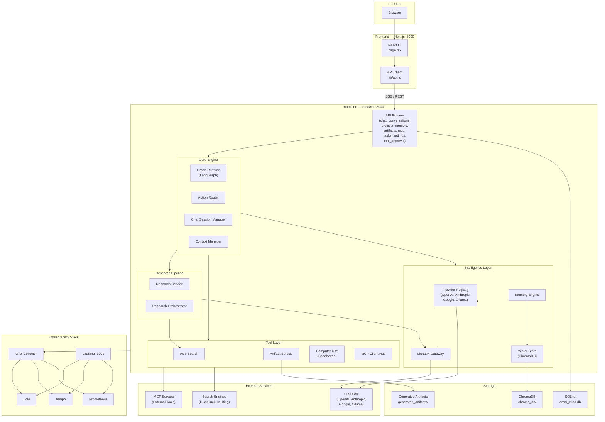

---

## 3. Repository Layout

```
omni-mind/
├── frontend/                    # Next.js app (React + TypeScript)
│   ├── src/
│   │   ├── app/
│   │   │   ├── page.tsx         # Main chat UI (single-page app)
│   │   │   ├── layout.tsx       # Root layout
│   │   │   └── globals.css      # Global styles
│   │   └── lib/
│   │       ├── api.ts           # Backend API client (SSE + REST)
│   │       └── models.json      # Static model definitions
│   ├── package.json
│   └── tsconfig.json
│
├── backend/                     # FastAPI backend (Python)
│   ├── main.py                  # App entrypoint, router registration
│   ├── requirements.txt
│   │
│   ├── api/                     # HTTP route handlers
│   │   ├── chat.py              # Main chat endpoint (SSE streaming)
│   │   ├── conversations.py     # CRUD for conversations
│   │   ├── projects.py          # CRUD for projects
│   │   ├── memory.py            # Memory retrieval endpoints
│   │   ├── artifacts.py         # Artifact listing/download
│   │   ├── mcp.py               # MCP server management
│   │   ├── tasks.py             # Research task tracking
│   │   ├── tool_approval.py     # Human-in-the-loop approval
│   │   └── settings.py          # Key-value settings store
│   │
│   ├── agents/                  # Agent orchestration
│   │   ├── action_router.py     # Intent classification (chat/artifact/research)
│   │   └── graph_runtime.py     # LangGraph state machine
│   │
│   ├── chat/                    # Chat session management
│   │   └── session_manager.py   # Conversation persistence & rolling summaries
│   │
│   ├── context/                 # Context window management
│   │   ├── manager.py           # Multi-layer context assembly
│   │   ├── summarizer.py        # LLM-powered conversation summarization
│   │   └── token_counter.py     # tiktoken-based token counting
│   │
│   ├── providers/               # LLM provider abstraction
│   │   ├── base.py              # Abstract base class + shared models
│   │   ├── registry.py          # Singleton provider registry
│   │   ├── openai_provider.py
│   │   ├── anthropic_provider.py
│   │   ├── google_provider.py
│   │   └── ollama_provider.py
│   │
│   ├── llm/                     # Provider-agnostic gateway
│   │   └── litellm_gateway.py   # LiteLLM wrapper for unified API
│   │
│   ├── memory/                  # Semantic memory system
│   │   ├── engine.py            # Fact extraction + storage orchestration
│   │   ├── extractor.py         # LLM-powered fact extraction
│   │   └── vector_store.py      # ChromaDB wrapper
│   │
│   ├── tools/                   # Built-in tool implementations
│   │   ├── web_search.py        # DuckDuckGo/Bing web search + URL scraping
│   │   ├── artifacts.py         # DOCX/XLSX/HTML/Plot generation
│   │   └── computer_use.py      # Sandboxed shell/file operations
│   │
│   ├── app_mcp/                 # Model Context Protocol client
│   │   ├── client.py            # MCPClientHub (stdio/HTTP/SSE transports)
│   │   ├── oauth.py             # OAuth flow for protected MCP servers
│   │   └── tool_converter.py    # MCP → OpenAI tool schema conversion
│   │
│   ├── research/                # Deep research pipeline
│   │   ├── service.py           # Task lifecycle (plan → execute → report)
│   │   └── orchestrator.py      # Agentic web research engine
│   │
│   ├── runtime/                 # Runtime guards
│   │   └── limits.py            # Semaphore-based concurrency limits
│   │
│   ├── db/                      # Database layer
│   │   ├── database.py          # SQLAlchemy async engine setup
│   │   ├── models.py            # All ORM models
│   │   └── migrations.py        # Schema compatibility checks
│   │
│   ├── observability/           # Telemetry instrumentation
│   │   ├── __init__.py
│   │   ├── telemetry.py         # OTel SDK initialization
│   │   └── metrics.py           # Custom metrics
│   │
│   └── tests/                   # Backend test suite
│
├── observability/               # Docker-based observability stack
│   ├── docker-compose.yml       # OTel Collector + Prometheus + Tempo + Loki + Grafana
│   ├── otel-collector-config.yaml
│   ├── prometheus.yml
│   ├── tempo.yaml
│   └── grafana/
│       ├── provisioning/        # Datasource auto-provisioning
│       └── dashboards/          # Pre-built Grafana dashboards
│
├── .env.example                 # Environment variable template
├── setup.sh                     # One-shot project setup script
├── start.sh                     # Start both frontend + backend
└── README.md
```

---

## 4. Request Lifecycle — End to End

This is what happens when a user sends a message:

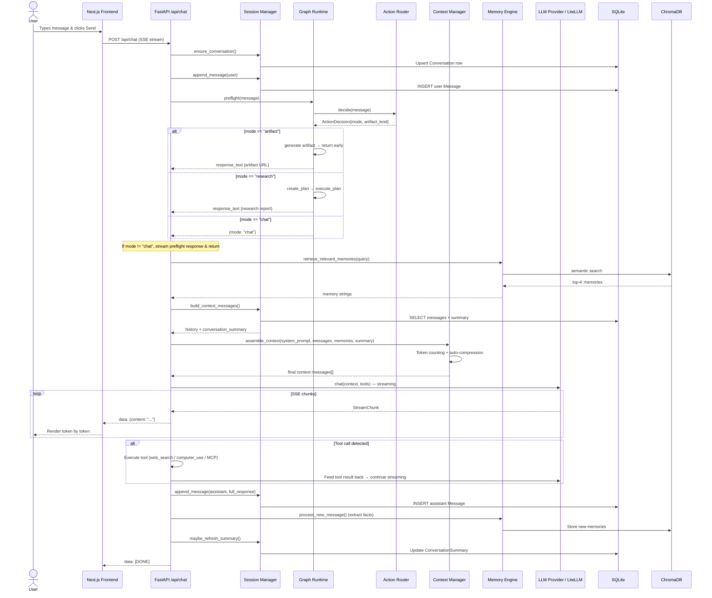

---

## 5. Backend Deep Dive

### 5.1 API Layer

The backend registers **9 routers** in `main.py`:

| Router | Prefix | Purpose |
|---|---|---|
| `chat` | `/api/chat` | Main chat endpoint (SSE streaming), provider listing, model listing |
| `conversations` | `/api/conversations` | CRUD operations on conversation history |
| `projects` | `/api/projects` | Group conversations under projects with custom instructions |
| `memory` | `/api/memory` | Query user memories |
| `artifacts` | `/api/artifacts` | List and serve generated artifacts |
| `mcp` | `/api/mcp` | Register, connect, and manage MCP tool servers |
| `tasks` | `/api/tasks` | Track research task runs and steps |
| `tool_approval` | `/api/tool-approval` | Human-in-the-loop tool execution approval |
| `settings` | `/api/settings` | Key-value settings persistence |

All responses from the chat endpoint use **Server-Sent Events (SSE)** for real-time token streaming.

---

### 5.2 Agent & Routing Layer

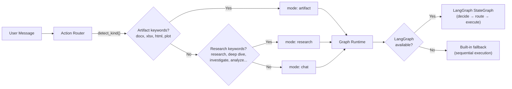

**Key files:**
- [`action_router.py`](file:///Users/charinpatel/workspace/projects/omni-mind/backend/agents/action_router.py) — Keyword-based intent classification
- [`graph_runtime.py`](file:///Users/charinpatel/workspace/projects/omni-mind/backend/agents/graph_runtime.py) — LangGraph state machine with graceful fallback

The **Graph Runtime** uses a `WorkflowState` TypedDict and builds a 4-node LangGraph:
1. `decide` — Classifies intent
2. `artifact` — Generates the requested file
3. `research` — Runs multi-step web research
4. `chat` — Falls through to the standard chat pipeline

---

### 5.3 LLM Provider System

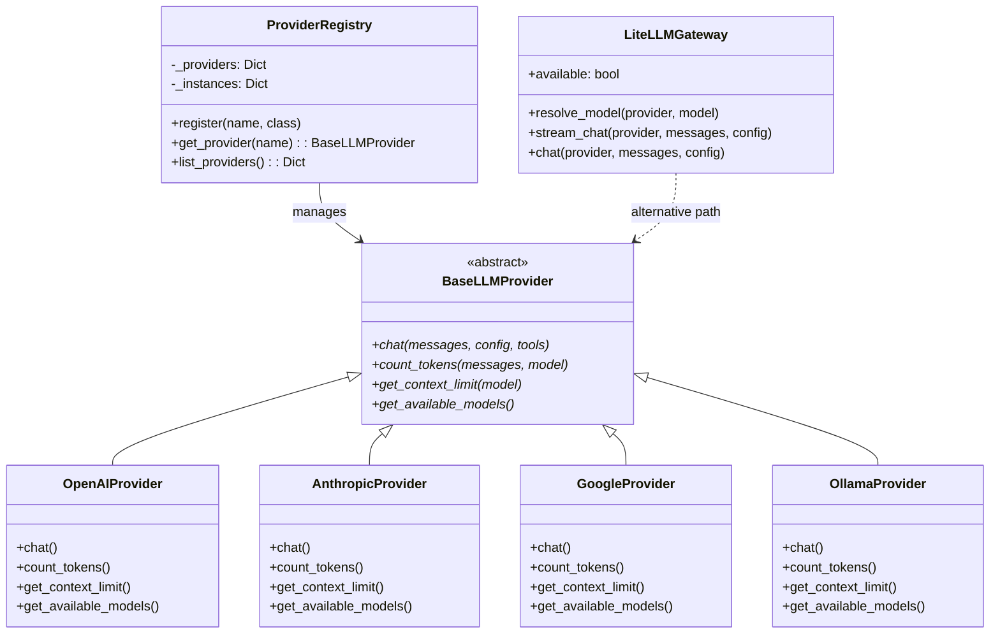

**Two execution paths:**
1. **Custom Providers** — Direct SDK integration (OpenAI, Anthropic, Google, Ollama) via the `ProviderRegistry`
2. **LiteLLM Gateway** — Provider-agnostic routing when `litellm` is installed. Used by the research pipeline and as a fallback chat path.

---

### 5.4 Context Window Management

The `ContextManager` assembles the final prompt through a multi-layer strategy:

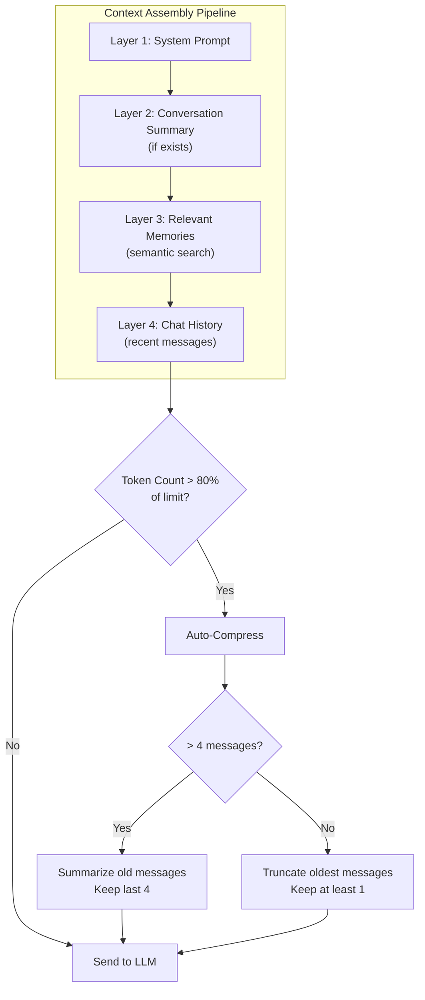

**Key details:**
- Context limit is resolved per-provider, per-model (up to 400K tokens max)
- 20% of the limit is reserved for the assistant's response
- Compression triggers at 80% usage
- Uses `tiktoken` for token counting (falls back to `cl100k_base` for unknown models)

---

### 5.5 Memory Engine

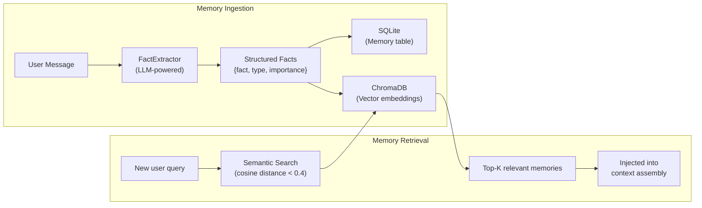

**Memory types:** `preference`, `decision`, `fact`, `event`

The `FactExtractor` asks the LLM to identify significant information from user messages and returns structured JSON. Memories are dual-stored: SQL for management, ChromaDB for retrieval.

---

### 5.6 Tool System

OmniMind has three categories of tools available to the AI:

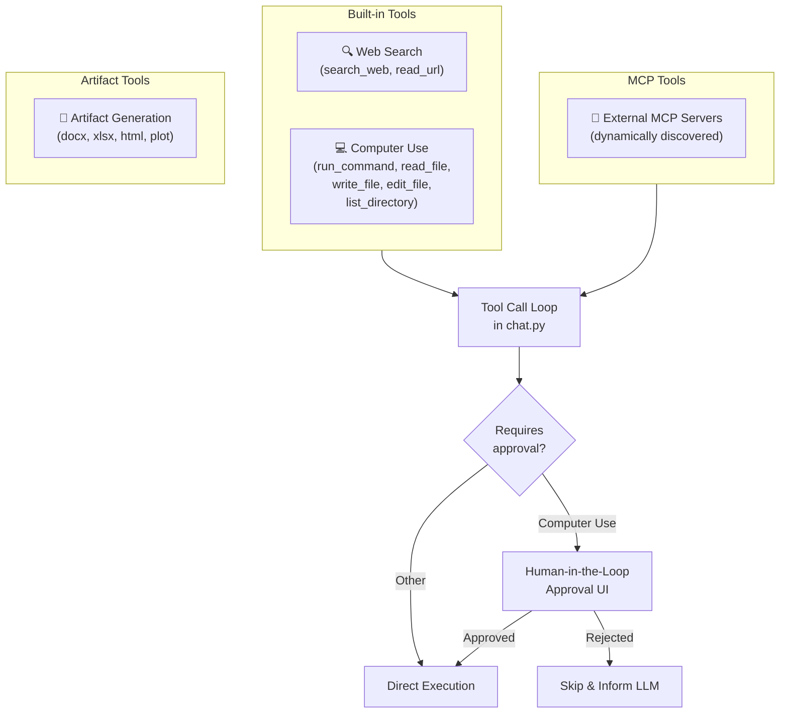

**Web Search** uses a 3-engine fallback strategy:
1. DuckDuckGo HTML
2. DuckDuckGo Lite
3. Bing HTML

**Computer Use** is sandboxed:
- All operations confined to `WORKSPACE_ROOT` (default: `~/omnimind-workspace`)
- Path traversal protection (`../../` blocked)
- Dangerous commands blocked (`sudo`, `rm -rf /`, `shutdown`, fork bombs, etc.)
- Output truncated at 50KB, file reads at 15KB

---

### 5.7 MCP Integration

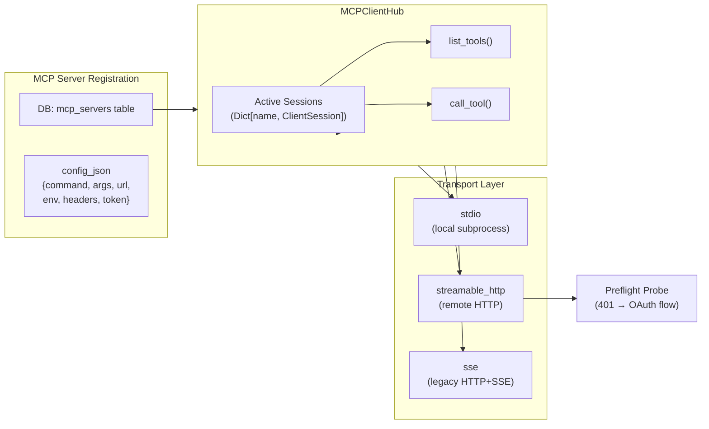

The MCP client supports OAuth 2.0 authorization for protected servers (RFC 9728 discovery).

---

### 5.8 Research Pipeline

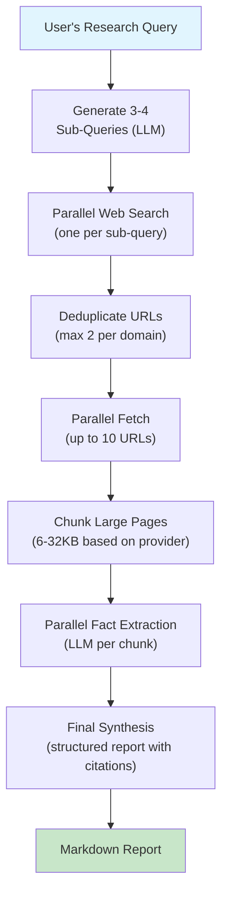

**Concurrency tuning by provider:**

| Provider | Max Concurrency | Chunk Size |
|---|---|---|
| Ollama / LMStudio | 2 | 6 KB |
| OpenAI / Anthropic / Google | 15 | 32 KB |
| Other | 5 | 12 KB |

Hard timeout: **2 minutes** for the entire extraction phase.

---

### 5.9 Artifact Generation

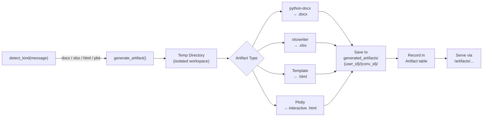

Artifacts are generated inside a `tempfile.TemporaryDirectory` for isolation, then moved to the permanent output directory.

---

### 5.10 Data Layer

All persistent data is stored in **SQLite** (async via `aiosqlite`), with **ChromaDB** for vector embeddings.

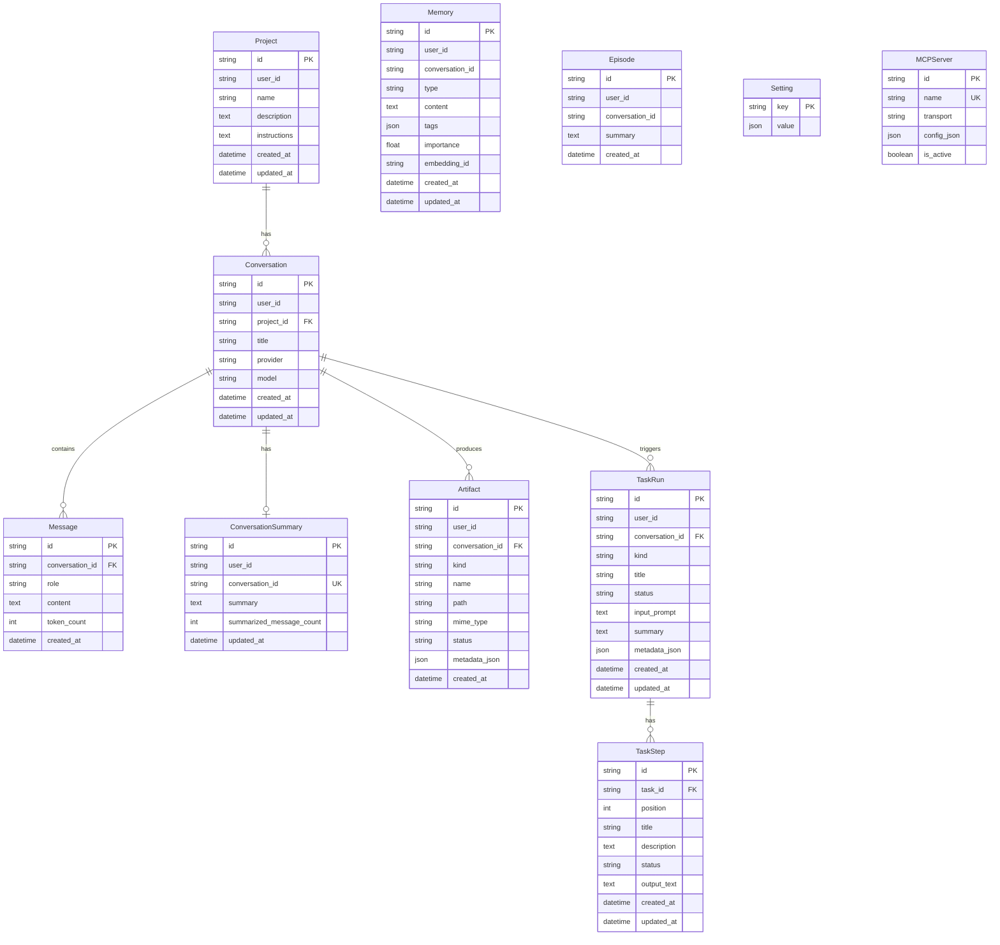

---

### 5.11 Runtime & Concurrency

The backend uses `asyncio.Semaphore` guards to prevent overload:

| Resource | Default Limit | Env Var |
|---|---|---|
| Chat requests | 40 | `CHAT_CONCURRENCY_LIMIT` |
| Artifact generation | 8 | `ARTIFACT_CONCURRENCY_LIMIT` |
| Computer use tools | 4 | `COMPUTER_USE_CONCURRENCY_LIMIT` |

---

## 6. Frontend Deep Dive

The frontend is a **Next.js** app with a single-page React UI.

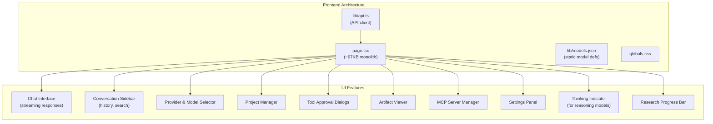

**Communication:**
- Chat uses **SSE (Server-Sent Events)** for streaming
- All other endpoints use standard REST
- SSE events include: `content`, `thinking_start/chunk/end`, `tool_approval_request`, `research_progress`, `tool_status`, `tool_sources`, `response_replace`, `[DONE]`

---

## 7. Observability Stack

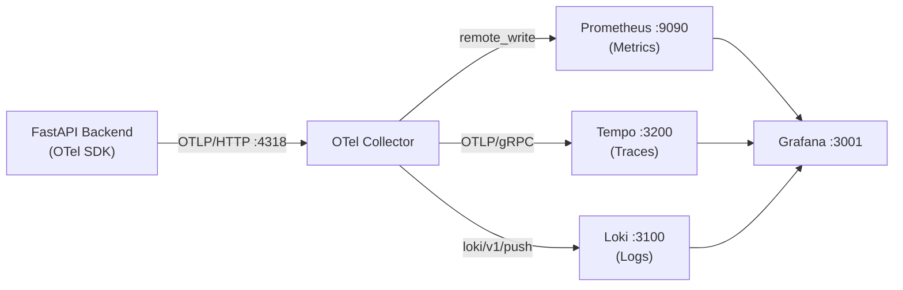

**Quick start:**
```bash
docker compose -f observability/docker-compose.yml up -d
# Then open http://localhost:3001 (anonymous admin, no login)
```

**Custom metrics** (defined in `observability/metrics.py`) are exported via the OTel SDK and scraped by Prometheus.

---

## 8. Data Flow Diagrams

### 8.1 Tool Call Loop (Agentic Execution)

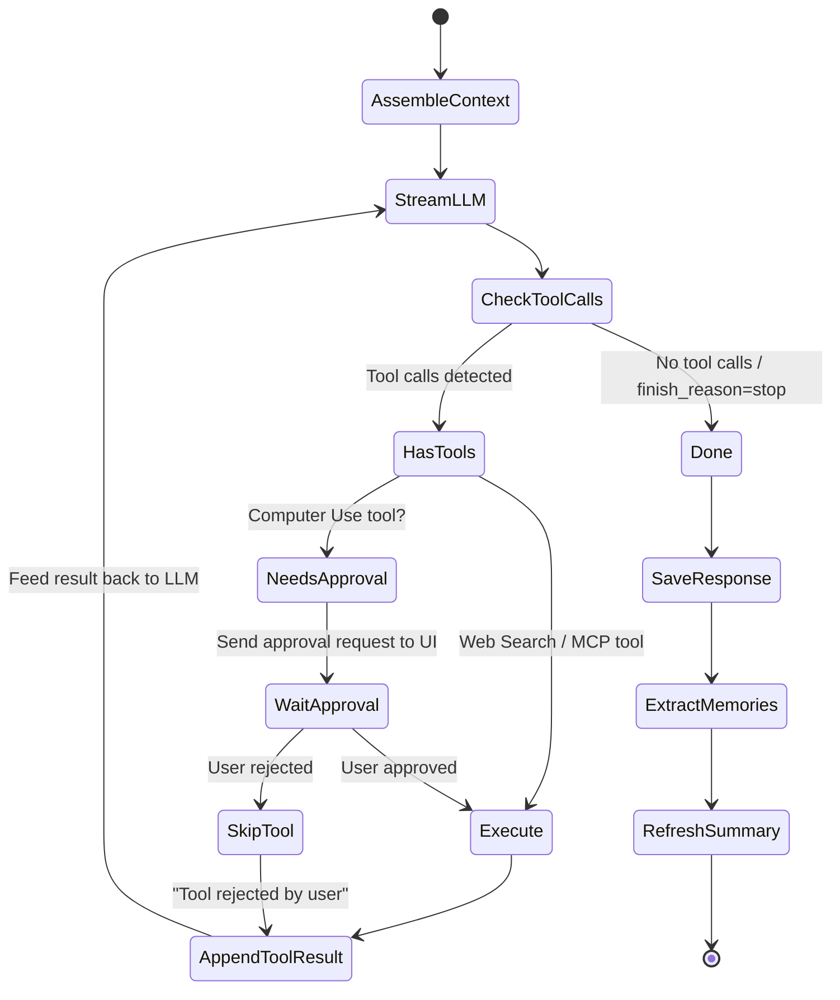

### 8.2 Memory Lifecycle

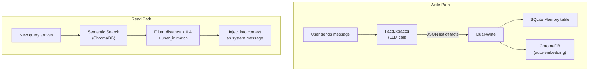

---

## 9. Database Schema (ER Diagram)

See the full ER diagram in [Section 5.10](#510-data-layer).

**Quick reference for table purposes:**

| Table | Purpose |
|---|---|
| `projects` | Grouping conversations under a shared context |
| `conversations` | Chat sessions with provider/model metadata |
| `messages` | Individual chat messages (user, assistant, system, tool) |
| `memories` | Extracted user facts and preferences |
| `episodes` | Conversation episode summaries |
| `conversation_summaries` | Rolling conversation summaries for context compression |
| `artifacts` | Generated file metadata (docx, xlsx, html, plot) |
| `task_runs` | Research task lifecycle tracking |
| `task_steps` | Individual steps within a research task |
| `settings` | Key-value configuration store |
| `mcp_servers` | Registered MCP server configurations |

---

## 10. Environment Variables Reference

| Variable | Default | Purpose |
|---|---|---|
| `OPENAI_API_KEY` | — | OpenAI provider authentication |
| `ANTHROPIC_API_KEY` | — | Anthropic provider authentication |
| `GEMINI_API_KEY` | — | Google Gemini provider authentication |
| `OLLAMA_BASE_URL` | `http://localhost:11434` | Ollama server address |
| `OLLAMA_NUM_CTX` | `16384` | Ollama context window size |
| `DATABASE_URL` | `sqlite+aiosqlite:///omni_mind.db` | Database connection string |
| `DEFAULT_CONTEXT_LIMIT` | `128000` | Fallback token limit |
| `COMPUTER_USE_WORKSPACE` | `~/omnimind-workspace` | Sandboxed workspace root |
| `CHAT_CONCURRENCY_LIMIT` | `40` | Max concurrent chat requests |
| `ARTIFACT_CONCURRENCY_LIMIT` | `8` | Max concurrent artifact generations |
| `COMPUTER_USE_CONCURRENCY_LIMIT` | `4` | Max concurrent computer-use tool executions |
| `NEXT_PUBLIC_API_BASE_URL` | `http://localhost:8000` | Frontend → Backend URL |

---

## 11. Extension Points

OmniMind is designed for expansion. Here are the key hooks:

| What to Add | Where to Hook |
|---|---|
| **New LLM provider** | Create a class extending `BaseLLMProvider` in `providers/`, register it in `providers/__init__.py` |
| **New built-in tool** | Add tool schemas + implementation in `tools/`, wire into the tool loop in `api/chat.py` |
| **New artifact type** | Add a `_create_<type>` method in `tools/artifacts.py`, update `detect_kind()` |
| **New API endpoint** | Create a new router in `api/`, register it in `main.py` |
| **External tools** | Register an MCP server via the UI or API — tools are auto-discovered |
| **Custom metrics** | Add counters/histograms in `observability/metrics.py` |
| **New research strategy** | Extend `ResearchOrchestrator` in `research/orchestrator.py` |
| **New database model** | Add an ORM class in `db/models.py` — auto-created on startup |

---

> **Tip for new contributors:** Start by reading [`api/chat.py`](file:///Users/charinpatel/workspace/projects/omni-mind/backend/api/chat.py) — it's the central hub that ties together all subsystems. Follow the imports to understand how each module connects.
